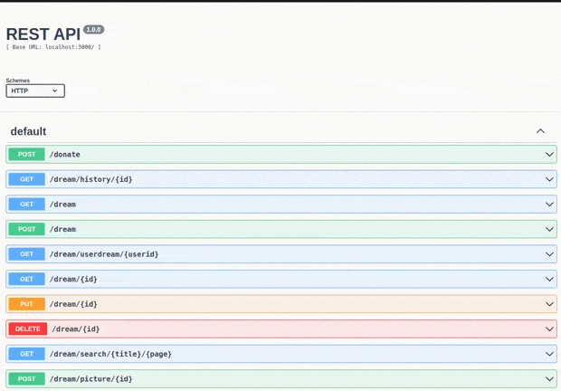
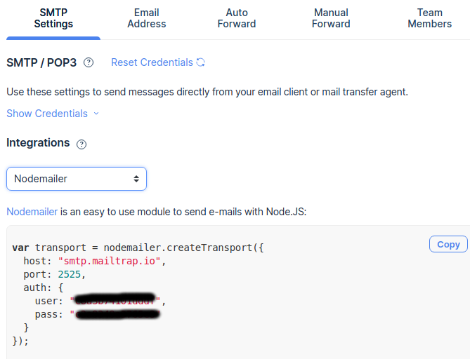

# Pode crer backend

# Tópicos

- [Introdução](#introdução)
- [Quais as tecnologias usamos no projeto](#quais-as-tecnologias-usamos-no-projeto)
- [Como rodar o projeto](#como-rodar-o-projeto)

# Introdução

A ideia do projeto é construir uma api para um sistema de crowdfunding. Nesse api podemos fazer ações básicas como criação de usuário, autenticação, criação de sonhos ( é assim que chamamos as campanhas de cada um ) e até mesmo coisas um pouco mais complexas como doações, envio de email via SMTP e armazenar as imagens dos sonhos em um serviço de storage dedicado

# Quais as tecnologias usamos no projeto

- [Express](https://expressjs.com/)
- [nodemon](https://nodemon.io/)
- [Firebase-cloud-storage](https://firebase.google.com/docs/storage)
- [Swagger](https://swagger.io/)
- [Sequelize](https://sequelize.org/master/)
- [postgresql](https://www.postgresql.org/)
- [nodemailer](https://nodemailer.com/)
- [integração com SMTP](https://mailtrap.io/)

# Como rodar o projeto

Para executar esse projeto você deve ter em sua maquina:

- [NodeJs](https://nodejs.org/en/) ( desenvolvido com node na versão 12+ )
- Uma conta _gratuita_ no [firebase](https://firebase.google.com/)
- Uma conta _gratuita_ em algum serviço de smtp ( recomendamos o [mailtrap](https://mailtrap.io/) ou [ethereal](https://ethereal.email/) )
- Conhecimento _básico_ sobre variáveis de ambiente com arquivo ".env" ( [material de apoio](https://blog.rocketseat.com.br/variaveis-ambiente-nodejs) )

## Primeiro passo

- Instale as depêndencias do projeto com o comando

`npm install`

- Agora devemos "cadastrar" algumas variáveis para nossa aplicações funcionar corretamente
  - Copie e cole na raiz do projeto o arquivo ".env.example", em seguida renomeie para ".env". Lembre-se que esse arquivo não vai para o versionamento pois trata-se de informações sensíveis.
  - defina um valor para PORT, pode ser 3000, 8001 ou alguma de sua preferênia
  - Com a conta _gratuita_ do firebase criada devemos gerar as chaves da conta de serviço, veja essa [issue](https://github.com/Vitor-Vaz/pode-crer-backend/issues/1)
  - Agora precisamos configurar os valores de JWT_SECRET e JWT_EXPIRES, recomendamos usar valores de 7d e usar um [hash](https://www.md5hashgenerator.com/) para o secret esses valores são usadoas para validação do token de autenticação e para gerar/comparar o hash de senha
  - agora precisamos das chaves do nosso serviço smtp, na dashboard do mailtrap exista a opção de integrações basta seleciona nodejs/nodemailer o valor do host vai para MAIL_HOST, port para MAIL_PORT, user para MAIL_USER, pass para MAIL_PASS. O valor MAIL_DEFAULT é um email aonde todos os email serão enviados recomendamos fazer seu uso.  

  
  

  Tenha em mente que a serviço gratuito do *mailtrap* pode ser visualizado apenas na plataforma deles portanto devemos fazer uso da dashboard para visualizar os email enviados.

## Segundo passo

Agora podemos executar um dos script de execução

`npm run dev`

é válido ressaltar que nosso projeto faz uso do nodemon para live-reload
